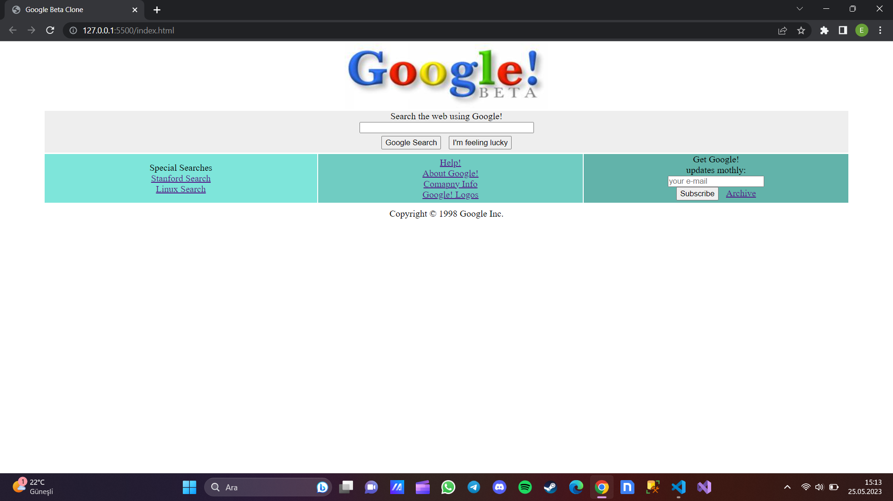

# Google Beta Clone

HTML ve CSS kullanarak oluşturduğum Google Beta Clone projesinin netlify'da yayınlanmış halini görmek için [tıklayınız]().

Bu projeyi yaparken kendimi geliştirdiğim ve öğrendiğim konular ise;

* Metin biçimlendirme özelliklerini kullanabilmeyi,

* Flex özelliklerini kullanarak konumlandırma yapabilmek.

**NOT:** Bu projede responsive tasarım yapılmamıştır.

## Projenin Görünümü

